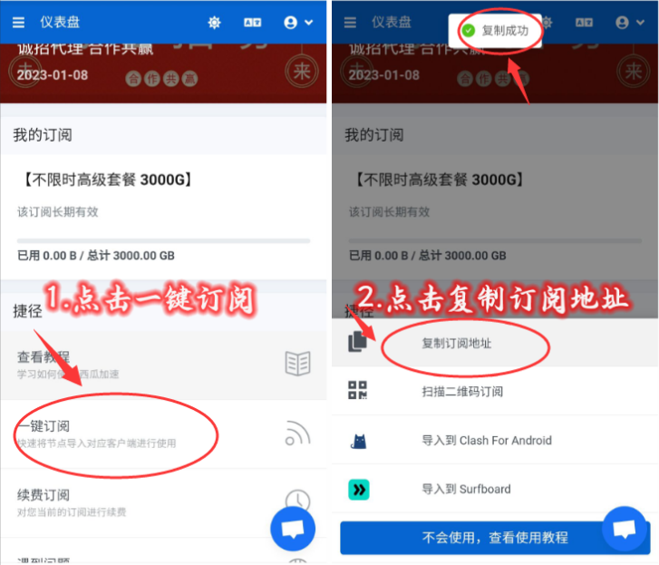

- # 第二步 购买节点连接国外网络

  ------

  ## 阅读前须知

  ⭕️第一步、购买国外节点连接国外网络
  ⭕️第二步、使用国外软件

  ### 请自备科学上网节点，如果没有推荐购买西瓜高速节点

  ### 可以解决Ins注册限制等等的问题，官网有在线客服在线排忧解难

## [🏆速度飞快不卡顿节点[点击购买]🏆](https://xiguajiasu.cc/#/register?code=6TVJEoae)

### https://xiguajiasu.cc/#/register?code=6TVJEoae

  > 节点网站是我们从网上搜集的速度快稳定的，只做推荐使用，有任何节点问题请直接联系网站客服。
  > 我们会持续为大家搜集，速度更快更稳定的节点。
  > 再次提醒：禁止使用节点进行任何违反法律的操作，因此操作产生的法律纠纷本店概不负责！

## 第一步、购买国外节点连接国外网络

### 1、复制下面这个网址到浏览器中打开

### https://xiguajiasu.cc/#/register?code=6TVJEoae

### 2、注册登录

### 3、购买订阅-选择合适的套餐付款

### 4、如何导入节点

#### 4.1、登陆后 往下滑点击一键订阅 - 选择复制订阅地址

#### 4.1、打开V2ray NG - 点击左上角 - 点击订阅设置 - 点击右上角加号

#### 4.3、粘贴订阅地址，备注任意写 - 点击右上角对号 - 返回V2ray NG首页 - 点击右上角三个点 -更新订阅

#### 4.4、继续点击右上角三个点 - 测试全部配置Tcping - 右侧会显示绿色数字，选择数字小的节点 - 点击右下角V

#### 4.5、如果是首次连接 会弹出网络连接请求 点击确定 （如果之前连接过免费节点 则没有这一步，略过即可）点击测试连接 如果这里连接成功 则表示国外网络正常使用了

## 第二步、使用国外软件

### 要先打开V2ray点击连接好节点，在打开你需要的软件软件比如推特/instagram等

### 推特/INS可以使用国内手机号来注册账号

