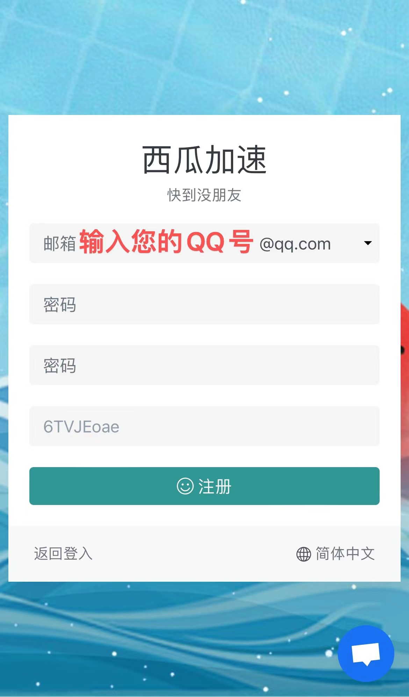
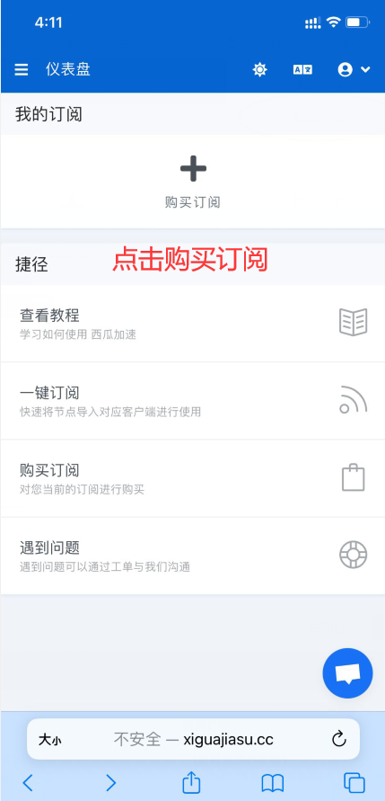
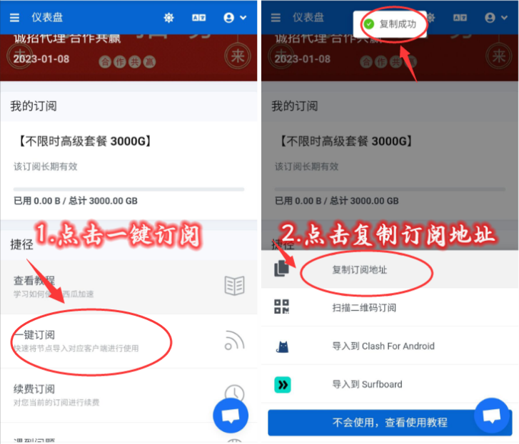
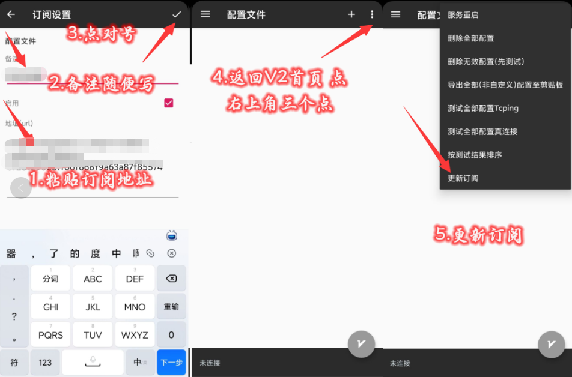
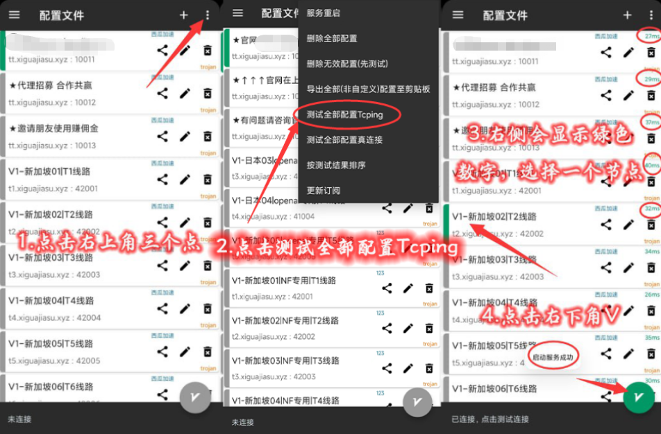
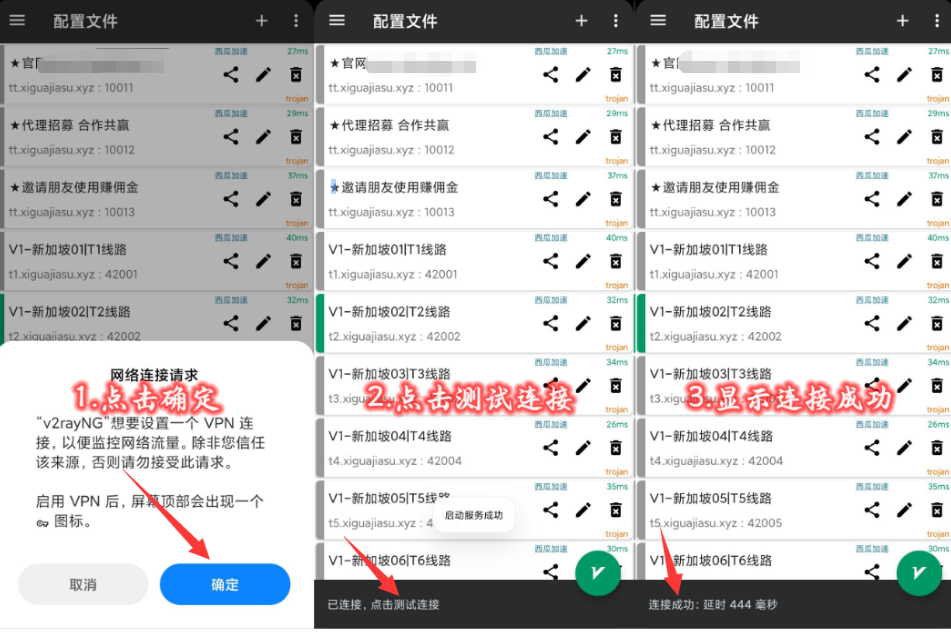

# chat gpt苹果使用教程

------

### chat gpt必须有账号，并且购买国外chat gpt专用节点才可以使用，账号购买后会直接发送，请返回聊天窗口查看，购买的账号内包含5美元，查询一次的收费很低，如下图，5美元用完了，再买一个新号即可，新账号内都有5美元。

[chat gpt账号购买【点击购买】](http://cat.fk6699.com/)


### chat gpt对线路要求非常高，需要购买国外节点后才可以使用，市面上绝大部分科学上网工具用不了，如果你自有的工具用不了chat gpt，那这里推荐购买西瓜高速节点

### 可以解决chat gpt登录使用限制等等的问题，官网有在线客服在线排忧解难

## [<font color=blue>🏆速度飞快不卡顿节点[点击购买]🏆</font>](https://xiguajiasu.cc/#/register?code=6TVJEoae)

### <font color=blue>https://xiguajiasu.cc/#/register?code=6TVJEoae</font>

> 节点网站是我们从网上搜集的速度快稳定的，只做推荐使用，有任何节点问题请直接联系网站客服。
> 我们会持续为大家搜集，速度更快更稳定的节点。
> 再次提醒：禁止使用节点进行任何违反法律的操作，因此操作产生的法律纠纷本店概不负责！

## 阅读前须知

【总体流程】

⭕️一、下载V2ray

⭕️二、购买节点

⭕️三、登录OpenAI账号

⭕️四、登录常见问题


## 温馨提示：

- ### 保姆级教程，按照流程走很简单

- ### 避免掉坑，争取一次成功！

  ### > 华为鸿蒙系统先退出纯净模式在安装

  ### > 打开手机设置–系统和更新–关闭纯净模式

## ⭕️一、下载安装v2ray

首先把教程里的V2ray软件安装好

### 👉 [点我下载V2ray](https://xiguajiasu.shop/anzhuo/v2ray.apk)👈

#### 下载完成后如下图


## ⭕️二、购买国外节点

### 1、复制下面这个网址到浏览器中打开

> ### <font color=blue>https://xiguajiasu.cc/#/register?code=6TVJEoae</font>

购买付费节点专享超高速网速，除了chat gpt，还可以使用tiktok、谷歌、ins、youtube、twitter等其它国外软件

### 2、注册登录



### 3、购买订阅-选择合适的套餐付款



### 4、导入订阅到V2rayNG

#### 4.1 购买订阅后打开西瓜加速官网 往下滑点击一键订阅 - 选择复制订阅地址



#### 4.2 打开V2ray NG - 点击左上角 - 点击订阅设置 - 点击右上角加号


#### 4.3 粘贴订阅地址，备注任意写 - 点击右上角对号 - 返回V2ray NG首页 - 点击右上角三个点 -更新订阅



#### 4.4 继续点击右上角三个点 - 测试全部配置Tcping - 右侧会显示绿色数字，选择数字小的节点 - 点击右下角V



#### 4.5 如果是首次连接 会弹出网络连接请求 点击确定 点击测试连接 如果这里连接成功 则表示国外网络正常使用了



#### 4.6 重点：选择美国、新加坡和日本可用 ，这些节点是解锁chat gpt的，选择其他节点无效，尤其不能选择香港、台湾、俄罗斯线路，这些地区禁用chat gpt


#### 为防止流量消耗，不使用的时候请回到v2rayNG点击右下角V把连接断开


## ⭕️三、登录OpenAI账号

一、chatgpt登陆：使用账号和密码登陆，
官网地址：https://chat.openai.com/
chat gpt账号购买地址：http://cat.fk6699.com/
1,点log in


2,进入后输账号，在输密码。


下一步即可进入到chatgpt页面。

#### 3、点NEXT 下一步将进入到聊天页面


#### 4、聊天应用场景

举例1：可以把它当作升级版的小度或者Siri，智能程度更高，它能够你跟它的聊天，来学习和理解人类的语言来进行对话，还能根据聊天的上下文进行互动，真正像人类一样来聊天交流


举例2：可以让它帮你做一些学习上的事情，让它帮你写一篇小作文，伪原创文章等等跟文字有关的工作。


举例3：可以把它当作你工作中的辅助工具，工作中有解决不了的问题，做短视频没有文案，都可以求助于它。


只要在聊天框中输入中文/英文以及更多国家的语言，发送回车，就可以使用了，如果chatgpt没回答完整，或者你还想让他继续解释，回答继续，他就会接着答了，更多好玩的可以自己研究。

### 用法二 写个论文 GPT-3 [AI写论文教程]

#### 1、打开下面的网址 点击登录Log in，登录账号和密码，这个账号和密码通用的，返回去复制，一定要注意，邮箱账号跟密码前后一定不能有空格，否则会导致登录错误

> ### https://openai.com/api/


#### 2、登录成功后，点击右上角三横杠，点击Playground


#### 3、点击右上角关闭，输入你想要查询的内容，根据下图3 可以设置更多的条件


#### 4、这里可以设置字数等其它条件，设置完成后点Submit 这样就可以生成论文了

```
默认最大是4000字符也就是2000字，小技巧：输入内容那里写上"不少于2000字"可以让字数更多
```


### 用法三 搞个图片 DALLE2 [AI绘画教程]

#### 1、打开下面的网址 点击登录Log in

> ### https://openai.com/dall-e-2/


#### 2、登录账号和密码，这个账号和密码通用的，返回去复制，一定要注意，邮箱账号跟密码前后一定不能有空格，否则会导致登录错误


#### 3、输入你想要生成图片的内容，描述的越详细越好，点击Generate

```
小技巧：如果你不知道这里的内容写什么，可以到用法一 chatgpt让ai帮你生成一段要描述的场景或事物，然后复制到Dalle2这里
```


chat gpt功能用法很多，你可以用来玩，可以用来学习，可以用来工作，也可以用来赚钱，比如有些短视频运营人员用方法三DALLE2 [AI绘画教程]，这个生成图片后制作成视频，上传到抖音/快手/视频号等平台，做一些高清壁纸项目，发散你的思维，挖掘它的更多的用法，希望这篇教程对您有所帮助

## ⭕️四、登录常见问题

### 1、账号登陆后出现下面这种情况该怎么办？


OpenAI's services are not available in your country. (error=unsupported_country)
意思是openai服务在你的国家不支持，出现这个问题的原因：
是因为你的IP还在国内，因为openai是不支持中国地区的，所以这里是工具的问题，也就是科学上网工具的问题。

#### 解决方式：

1、检查是否链接了国外网络，使用浏览器打开下方youtube官网，看下能否访问，如果这个不能访问，清检查小火箭设置

> [https://www.youtube.com](https://www.youtube.com/)

2、小火箭工具一定要开全局，全局路由这里一定要选择代理模式

3、节点不要选香港、台湾、俄罗斯、越南。如果是使用我们推荐购买的XSUS节点，要点击新加坡和日本、美国节点，后面都有标注

4、清除浏览器记录，如果你的系统版本跟下图不一致，可以根据你手机系统型号百度搜索：如何清除历史记录


5、关了浏览器，重新打开，重新登陆openai。

大部分情况，以上这样操作就可以了，不行的话要多试几次，实在还不行，就换个浏览器。

### 2、使用中出现下面这种情况该怎么办？


出现请求太多，稍后再试的问题，表明科学上网的节点，也就是你选择的国家或地区的ip使用次数过多，那么如何解决呢？科学上网工具换节点线路（也就是换国家或地区，但是必须要选择解锁chat gpt的节点），如果还是不行的话可以晚点再试。

### 3、出现英文提示服务器爆满的情况，解决办法是等会再重试，因为近两天OPEN AI实在太火了！